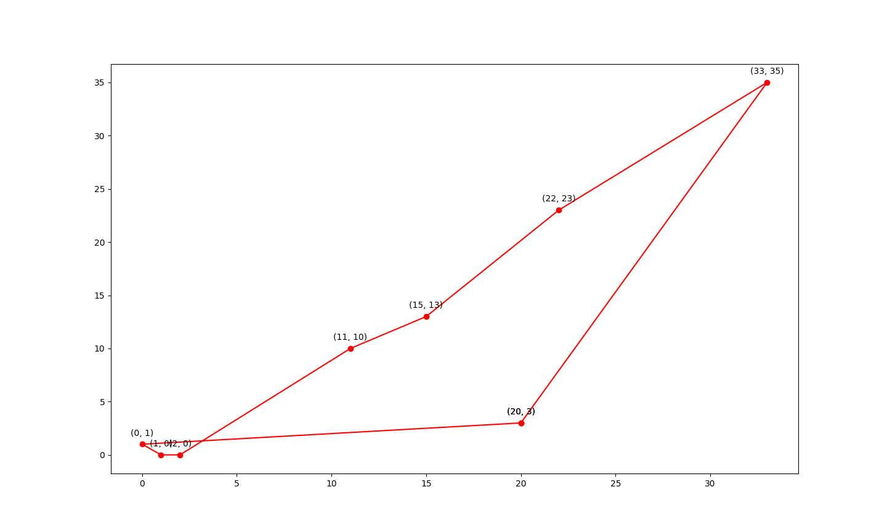

### Genetic Algorithm

### Result

Example:

```shell
[(0, 1), (1, 0), (2, 0), (11, 10), (22, 23), (33, 35), (15, 13), (20, 3)]
```

Figure:



Output:

```shell
The best path: [(20, 3), (0, 1), (1, 0), (2, 0), (11, 10), (15, 13), (22, 23), (33, 35)]
The fitness value: 103.9927971418631
```