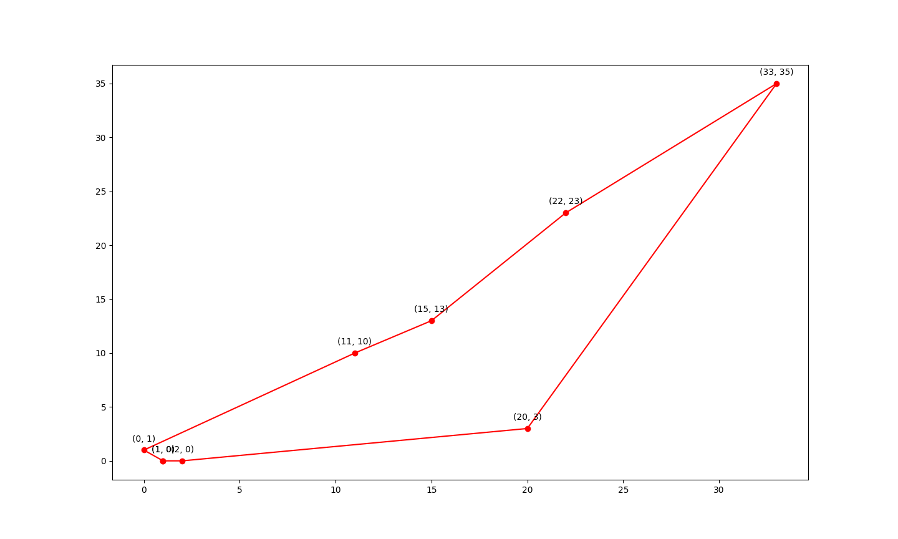

### Genetic Algorithm

Install dependencies:

```shell
$ pip3 install -r requirements.txt
```

Example:

```shell
$ python3 ga.py \
  --data '[(0, 1), (1, 0), (2, 0), (11, 10), (22, 23), (33, 35), (15, 13), (20, 3)]' \
  --population-size 800 \
  --selection-operator 'sort' \
  --crossover-rate 0.1 \
  --mutation-rate 0.1 \
  --num-iterations 200 \
  --seed 33 \
  --plot-result
The best path: [(1, 0), (2, 0), (20, 3), (33, 35), (22, 23), (15, 13), (11, 10), (0, 1)]
The fitness value: 102.90037984699414
```

Figure:

